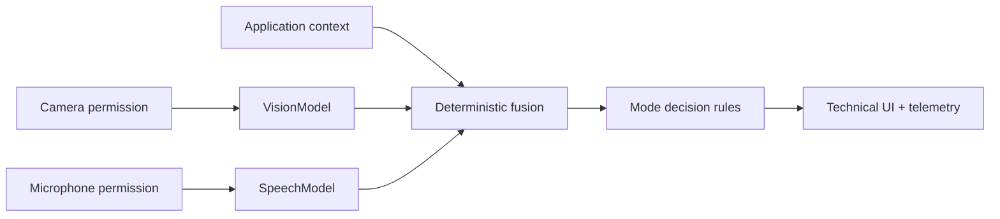

# Architecture

Status: **IMPLEMENTED baseline**.

The browser requests camera and microphone access. It sends frames and short audio buffers to `/api/vision` and `/api/speech` concurrently. `pipeline.py` invokes independent cached workers, then `/api/fuse` and `fusion.py` merge only structured outputs. `decision.py` applies explicit rules for Study, Interview, and Coding modes. No language model is used for fusion or local decisions. `/api/analyze` remains available for benchmark and non-browser callers and runs both workers concurrently.

`UNKNOWN` means the worker or measurement is unavailable. `PENDING` means a target workflow has not been verified. Raw media is not stored by the server.
